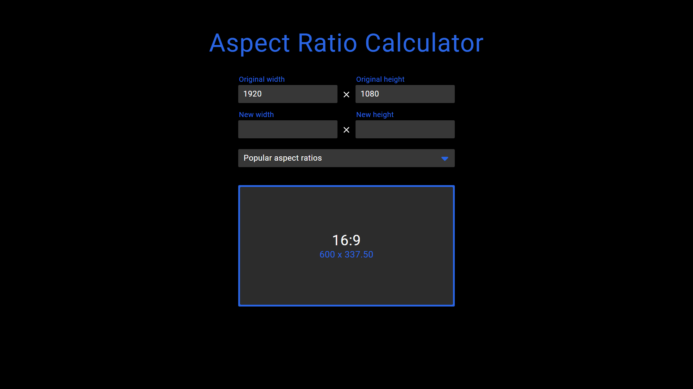

# Aspect Ratio Calculator

## What is this project?

The Aspect Ratio Calculator is a web-based tool designed to help users quickly calculate and visualize aspect ratios for images, videos, and other media. It allows you to enter original dimensions, select from popular aspect ratios, and instantly see the corresponding new dimensions-all with a live preview.



## Why did I build it?

When working with digital media, maintaining the correct aspect ratio is crucial to avoid distortion. I often found myself needing to resize images or videos for different platforms, and wanted a fast, reliable way to calculate new dimensions while preserving the original aspect ratio. Most online tools were either cluttered or lacked flexibility, so I decided to build my own solution focused on functionality and ease of use.

## Technologies and Tools Used

- **HTML, CSS, JavaScript**: The project is built using vanilla web technologies for maximum compatibility and performance.
- **Custom Utility Library**: I use my own `general.js` library, which I have developed and refined over the years, to handle common DOM and math operations.
- **FontAwesome**: For clean, modern icons in the UI.

## How it works (with code examples)

### Core Calculation Logic

The calculator uses a custom `ratio` object (from `general.js`) to handle all aspect ratio math:

```js
const ratio = {
   getWidth(width, height, newHeight) {
      return (width / height) * newHeight;
   },
   
   getHeight(width, height, newWidth) {
      return (height / width) * newWidth;
   },
   
   get(width, height) {
      let gcd = (a, b) => (b === 0 ? a : gcd(b, a % b));
      let ratio = gcd(width, height);
      return `${width / ratio}:${height / ratio}`;
   }
};
```

When a user enters a new width or height, the calculator automatically computes the corresponding value to maintain the aspect ratio:

```js
calc(value) {
   let originalWidth = Number(index.input.originalWidth.value);
   let originalHeight = Number(index.input.originalHeight.value);
   let newWidth = Number(index.input.newWidth.value);
   let newHeight = Number(index.input.newHeight.value);
   
   if ((value === 'w') && ((index.input.originalWidth.value !== '') && (index.input.originalHeight.value !== ''))) {
      newWidth = ratio.getWidth(originalWidth, originalHeight, newHeight)
      if (newWidth.toString().indexOf('.') > -1) {
         newWidth = newWidth.toFixed(2);
      }
      index.input.newWidth.value = newWidth;
   } else if ((index.input.originalWidth.value !== '') && (index.input.originalHeight.value !== '')) {
      newHeight = ratio.getHeight(originalWidth, originalHeight, newWidth)
      if (newHeight.toString().indexOf('.') > -1) {
         newHeight = newHeight.toFixed(2);
      }
      index.input.newHeight.value = newHeight;
   }
   index.updateExampleSize(index.input.originalWidth.value, index.input.originalHeight.value);
}
```

### Interactive UI

The UI is kept intentionally simple, but interactive. Users can select from a dropdown of popular aspect ratios:

```html
<div class="ratioSelect">
   <div class="ratioSelectDisplay">
      <span>Popular aspect ratios</span>
      <i class="fa-solid fa-caret-down"></i>
   </div>
   <div class="ratioSelectOptions">
      <div class="ratioSelectOption" option="0">
         <span class="optionAspectRatio">16:9</span>
         <span class="optionDimensions">7680 x 4320</span>
         <span class="optionName">8K UHD</span>
      </div>
      <!-- ...more options... -->
   </div>
</div>
```

When an option is selected, the calculator updates the preview and input fields accordingly:

```js
selectRatioOption(e) {
   index.input.newWidth.value = '';
   index.input.newHeight.value = '';
   switch (e.currentTarget.getAttribute('option')) {
      case '0':
         index.updateExampleSize(7680, 4320);
         break;
      case '1':
         index.updateExampleSize(3840, 2160);
         break;
      // ...other cases...
   }
}
```

### My Personal Utility Library

A lot of the event handling and DOM manipulation is powered by my own `general.js` library. For example, adding event listeners in a flexible way:

```js
const listener = {
   add(arg1, arg2, arg3, arg4) {
      // ...existing code...
      if (typeof elements === 'string') {
         elements = document.querySelectorAll(elements);
      }
      // ...existing code...
      for (let element of elements) {
         for (let eventChild of events) {
            element.addEventListener(eventChild, listener.functions[name].function);
         }
      }
   },
   // ...existing code...
};
```

## What have I learned?

This project reinforced the value of building reusable utility code and focusing on core functionality before UI polish. By creating my own event and math helpers, I was able to rapidly prototype and iterate on the calculator logic. I also gained more experience with dynamic DOM updates and keeping the user experience smooth and responsive.

A better UI is planned for the future, but the current version already demonstrates my ability to deliver a working, maintainable solution.

If you’d like to know more about the project, feel free to reach out!
